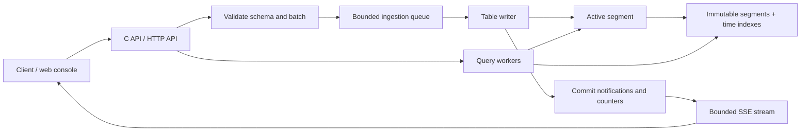

# WebAnalyticsDB architecture plan

Status: v1 implemented and validated, with ingestion-time ordering and a single-machine first version confirmed on September 28, 2026. This document records the design. See [implementation status](implementation-status.md), the [acceptance audit](architecture-audit.md), and the [measured release report](benchmarks/release-2026-09-28.md) for evidence and tested limits.

## Direction

Build a C17 database whose primary storage structure is a **segmented, append-only sorted row log with a sparse time index**. Each table defines one immutable fixed-width row layout. Appends are serialized per table; reads locate a time interval and scan contiguous batches. Closed segments are immutable.

The first version is a single process on local storage, exposed as a C library and a server with a small web console. Establish capacity with benchmarks before choosing throughput targets or introducing distribution.

This structure follows the useful properties of segmented logs: batch writes, sequential reads, segment rotation, and cheap removal of old segments. Kafka documents these mechanics in its [design](https://kafka.apache.org/41/design/design/) and [log implementation](https://kafka.apache.org/41/implementation/log/). The database described here adds fixed schemas and analytics queries; Kafka is not a runtime dependency.

| Candidate | Fit for this workload | Decision |
| --- | --- | --- |
| B+ tree | Supports ordered appends, but general insertion, mutable pages, and tree maintenance buy little for the primary timeline | Do not use for primary storage |
| LSM tree | Useful when arbitrary keys and updates must be accepted; sorting and compaction are unnecessary for an already ordered stream | Do not use for primary storage |
| Segmented sorted row log | Writes the tail, seals files, searches a small array of time ranges, then scans | Use for v1 |
| Columnar storage | Can reduce bytes read for aggregations over a few fields, but adds a second layout or more complex commit handling | Benchmark as a later derived representation |

Fixed-width rows optimize append and addressing; they do not automatically make broad analytical scans optimal. Preserve room for columnar projections and rollups without making the initial storage engine depend on them.



## What to retain from the repository

Keep the static-library/executable split, Unity, and the behavioral examples for half-open time ranges and time buckets. Replace `WebEvent`, `Timeline`, raw struct persistence, and result pointers into a growable array. `main.c` was initially a placeholder and now provides the server and integrity CLI.

Initial inspection found these problems in the former prototype; the source paths and line numbers below refer to that historical version:

- `src/timeline.c:69` writes from `t->events` instead of `t->events + t->first_unwritten`; a second flush can duplicate early records and omit new ones.
- Expansion failure is ignored by the append function. Loading allocates the entire file, can leak an existing allocation, and calls `fclose(NULL)` on one error path.
- Files have no schema/version header, checksum, durable commit boundary, or crash recovery. Native C struct layout is the disk format.
- Wall-clock time can move backward, invalidating the ordering assumed by binary search.
- Bucket results borrow pointers that become invalid when append reallocates the timeline. Bucket arithmetic and allocation sizes also need overflow bounds.
- `make test` pipes test output through `tee` without propagating individual executable failures reliably. Run executables directly until this is fixed.

All 18 existing tests passed in a fresh build using Xcode's bundled macOS 26.4 SDK. Plain `make` failed because the selected command-line-tools SDK and linker disagree about an architecture in `libSystem.tbd`; do not interpret that environment failure as a code regression. Existing tests do not cover the repeated-flush bug or crash safety.

## Data and ordering contracts

### Tables and rows

- A table has a persistent ID, name, immutable schema, computed row width, and retention configuration. Tables may have different row widths; every row in one table has the same width.
- Support signed/unsigned integers, IEEE-754 floats, boolean, `timestamp_us`, UUID/fixed bytes, bounded UTF-8 text, and dictionary-backed `symbol32` fields. Add primitive types first, then symbols before calling the analytics MVP complete.
- Every row includes `_time`: a server-assigned signed 64-bit Unix timestamp in microseconds. An optional user field such as `occurred_at` preserves client event time.
- Compile field offsets once at table creation. Use a fixed null bitmap only when nullable fields exist, fixed slots for all fields, and explicit padding to an 8-byte row boundary. Null slots and padding have canonical zero bytes.
- Define little-endian encoding explicitly. Encode/decode with checked byte operations or `memcpy`; never persist a native struct or assume unaligned pointer casts are portable.
- A bounded text slot contains a fixed-size length field and a fixed-capacity payload. Reject overflow and invalid UTF-8; never silently truncate.
- Proposed starting limits: 256 fields, 16 KiB row width, 1 MiB encoded append request including dictionary additions, and a separate HTTP body limit. These are tunable limits to validate, not established optimal values.
- No update, upsert, arbitrary-position insert, or row-level delete. Retention removes whole segments. Change a schema by creating a new table; automatic schema evolution is outside v1.

An illustrative non-nullable page-view layout is 48 bytes:

| Field | Type | Bytes |
| --- | --- | ---: |
| `_time` | `timestamp_us` | 8 |
| `site_id` | `u32` | 4 |
| `visitor_id` | `bytes[16]` | 16 |
| `path` | `symbol32` | 4 |
| `referrer` | `symbol32` | 4 |
| `duration_ms` | `u32` | 4 |
| `status` | `u16` | 2 |
| `country` | `bytes[2]` | 2 |
| `device` | `u8` | 1 |
| `flags` | `u8` | 1 |
| Explicit padding | — | 2 |

This is an example schema, not a built-in event type. Separate tables can describe page views, clicks, errors, or application-specific measurements.

### Ordering

The table writer samples the clock once per accepted request and assigns `_time = max(realtime_us, last_assigned_time)` to all its rows, along with monotonically increasing 64-bit row sequence numbers. This keeps an atomic request in one time partition; sequence numbers break timestamp ties. Sequence is implicit in each frame's `first_sequence + row_index`, avoiding an extra field in every row.

Ordering is per table. Concurrent producer requests are ordered when the writer accepts them. There is no promised ordering across tables. Reject attempts to supply `_time` through the normal append API.

On restart, recover the last sequence and timestamp before accepting writes. Preserve these watermarks in durable metadata before retention removes their final on-disk evidence. Detect sequence overflow. Use a monotonic clock for deadlines and rates, and expose backward-clock adjustments as a metric. A forward clock jump affects ingestion timestamps and partitioning; clock adjustment does not recover the true event time.

Late events still append at the current ingestion time. Filtering on `occurred_at` cannot use the primary time index to exclude ingestion intervals unless an explicit lateness bound is known. Event-time queries must scan all relevant retained ingestion data or a later secondary structure. QuestDB describes this same [ingestion-time versus event-time tradeoff](https://questdb.com/docs/concepts/out-of-order-data/).

Historical ingestion-time backfill is outside the normal write API. A legacy importer, if needed, appends now and preserves the old timestamp in a separate field.

## Storage layout

```text
data/
  LOCK
  catalog                         # durable table definitions and lifecycle metadata
  tables/<table-id>/
    manifest                      # segment states, retired IDs, preserved watermarks
    2026-09-28/
      0000000000000001.seg         # immutable header followed by append frames
      0000000000000001.idx         # rebuildable time/sequence index
      0000000000000002.seg         # active segment identified by manifest
```

Use UTC-day partitions initially, with size-based rotation within a day. A tentative segment target is 256 MiB; rotate only between complete frames, and use the next partition on the next append when the UTC day changes. Close an idle active segment when retention needs to retire it. Filenames use engine-generated IDs, never untrusted table names.

One active segment exists per table. Partitioning and segment sizes bound recovery work and retention granularity; they are not a promise that every query reads one file. Avoid creating one table or partition per visitor.

### Segment and frame format

The immutable segment header contains magic, format version, table/segment IDs, schema identity, row width, partition bounds, first sequence, and a header checksum. The schema is durably installed before any segment using it is accepted. Exact field widths and checksum coverage belong in a byte-level format specification in milestone 1.

```text
segment header
frame header | dictionary additions | fixed-width rows | frame trailer
frame header | dictionary additions | fixed-width rows | frame trailer
...
```

Each frame carries bounded lengths, row count, first sequence, minimum/maximum `_time`, and offsets needed to locate the row payload. The trailer repeats the frame length and includes a checksum covering the header, dictionary definitions, and rows. Validate lengths and overflow before allocation or pointer arithmetic. No frame crosses a segment or day boundary.

Coalesce small requests into one frame up to a byte target or maximum wait. A request is never split across frames in v1, so request atomicity follows frame atomicity. Oversized requests are rejected before mutation. Proposed starting settings are 256 KiB target frames and a 5 ms batching delay; a legal large request may exceed the target up to the hard bound.

Rows are fixed-width even though framing and dictionary metadata have variable lengths. Inside a frame:

```text
row_offset(i) = row_payload_offset + i * schema.row_width
```

There is deliberately no claim that row N can be located as `file_header + N * row_width` across the whole file: frame metadata occupies space. The frame index provides the missing level of addressing.

### Dictionary fields

URLs, referrers, and user-agent strings should not require large padded fields in every row. A `symbol32` stores a 32-bit ID; the corresponding string lives in a dictionary scoped to one column and one segment.

New definitions are written in the same checksummed frame as the first rows using them. They become visible together. Rebuild dictionaries from the log and optional derived checkpoints, so a crash cannot leave a committed row pointing at an uncommitted external string file.

An in-memory hash table accelerates interning, but equality always compares actual strings. Do not replace strings with unchecked hashes. Bound string lengths and dictionary bytes; rotate before a new request would exceed a segment budget, and reject a request that cannot fit even in an empty segment. IDs from different segments are not comparable. Filters resolve strings per segment; grouping across segments merges by string value.

Dictionary memory is bounded for active writers and uses a bounded cache for sealed-segment reads. Repeated definitions across segments are an intentional tradeoff for simple retention. High-cardinality strings require their own benchmark workload.

### Indexes and reads

Maintain a sorted segment directory and a flat array with one entry per committed frame:

```text
min_time, max_time, first_sequence, row_count,
frame_offset, row_payload_offset, frame_length
```

This is sparse relative to rows and append-only while the segment is active. Binary-search the first entry whose `max_time >= query_start`, then scan through entries whose `min_time < query_end`. Apply the same overlap rule to segments so repeated timestamps spanning boundaries are never skipped. Sequence ranges support cursors without scanning from the start.

Indexes are derived data. Bind them to segment identity, format version, covered byte length, and checksums. Publish sealed indexes through temporary files and atomic installation. An absent, stale, or invalid index triggers rebuilding from validated frames, not lost records. Cache index pages with a memory budget rather than loading every historical row or index into RAM.

A time-range query costs metadata searches plus the frames and rows it actually examines. It is not universally `O(log N)`: returning or aggregating K matching rows normally requires scanning them. Later min/max summaries, bloom filters, or rollups should be added only for demonstrated query needs.

## Append, durability, recovery, and concurrency

### Write path

1. Validate the entire request against the table schema and resource limits; reserve bounded queue capacity.
2. The owning writer assigns order and ingestion timestamps, resolves symbols, and assembles a frame. Keep dictionary changes provisional until commit.
3. Append with checked `write`/`writev` loops that handle short writes and `EINTR`.
4. Synchronize the segment through a platform durability abstraction. One synchronization can cover multiple requests.
5. Publish the committed byte boundary, sequence watermark, and corresponding index/dictionary state as one consistent reader view.
6. Acknowledge each request and enqueue a lightweight commit notification for monitoring.

The v1 contract is durable acknowledgement: success means the rows survive a crash within the tested filesystem/device failure model. Do not label a successful `write`, `fflush`, or `fclose` as durable. Linux requires file synchronization and separate directory synchronization for newly created entries; see [fsync(2)](https://man7.org/linux/man-pages/man2/fsync.2.html). Implement and test the corresponding macOS full-flush behavior behind the same abstraction; Apple's [fsync documentation](https://developer.apple.com/library/archive/documentation/System/Conceptual/ManPages_iPhoneOS/man2/fsync.2.html) distinguishes ordinary synchronization from full device flushing.

There is no separate row WAL in v1: the checksummed segment log is the authoritative recoverable copy. This avoids writing the same rows to a WAL and then to another row store. Schema/catalog durability still needs its own metadata protocol.

On write/sync failure, do not acknowledge success or publish the new boundary. Stop writes to that table and recover before resuming; do not append past a possibly broken frame. Return a distinct indeterminate-outcome error when data may have reached disk. A timeout or lost response may leave a complete request committed. Retrying can duplicate it; v1 does not claim exactly-once ingestion or persistent idempotency.

### Metadata and restart

Use serialized metadata updates with versioned, checksummed snapshots: write a temporary file, synchronize it, atomically install it, then synchronize its directory. Validate this on supported filesystems. File creation and directory durability are separate from row durability, as illustrated by [SQLite's atomic-commit discussion](https://www.sqlite.org/atomiccommit.html).

- Create and synchronize a new segment/header and its directory before publishing it in the durable manifest. Only then allow acknowledged appends to that segment.
- Keep segment filenames stable during rotation. Synchronize the old tail, publish the sealed state and the new active segment through the manifest, and build derived indexes independently. A crash at any transition must resolve to one writable tail.
- Acquire an exclusive process lock on the database directory. Validate metadata versions and all referenced file identities before serving traffic.
- Scan the active tail from a validated boundary, checking frame lengths, checksums, sequence continuity, timestamps, and symbol definitions. Recover only a complete contiguous prefix.
- A partial final frame from an interrupted append is a recoverable tail condition under the supported storage model. A complete frame with a bad checksum, damage in sealed data, or an unexplained sequence gap is reported as corruption; preserve evidence and stop writes instead of silently discarding possibly acknowledged data.
- Complete frames whose responses were lost may appear after recovery. Requests remain all-or-none, but an uncertain client cannot infer that absence of success meant absence of commit.
- Rebuild missing derived indexes. Check sealed frames when read, and offer an explicit full integrity scan; normal startup need not reread every retained byte.
- Unreferenced files left by interrupted creation are quarantined or cleaned through a deterministic lifecycle rule, never automatically imported as live data.

Crash recovery and media-corruption repair are different operations. Checksum detection alone does not recover damaged durable data. Backups remain necessary for that failure class.

### Reader and writer isolation

Start with one dedicated writer thread scheduling all tables fairly, one HTTP event loop, and a bounded query pool. Each table has a single writer owner. This is simpler than allocating a thread per table and makes the first capacity limit measurable. Later, assign different tables to multiple writer threads without changing the on-disk format; splitting one table into shards would change its ordering/query contract and is deferred.

Readers acquire a snapshot containing a segment-list generation, per-segment committed boundaries, and an upper sequence watermark. Use reference counts or equivalent lifetime control; a short metadata lock is acceptable initially. Release locks before disk scans. Readers never inspect partially written frames or receive pointers into a writer's reallocatable buffer.

Use `pread` and OS caching first. Consider read-only mappings of sealed files after measuring them; avoid writable mappings of a growing file in the initial durability path. Bound open descriptors, active-table buffers, queued bytes, query scratch space, and result sizes. Backpressure should return a clear retryable status, not allocate without limit.

## Query contract

Expose a small structured query API first. A SQL parser, joins, and arbitrary expressions would expand scope without improving the core append path.

Support:

- Projection and scans over `_time` ranges `[start, end)`, with a limit and a sequence cursor.
- Typed equality/range filters; start with conjunctions.
- `COUNT`, `SUM`, `MIN`, `MAX`, `AVG`, fixed-duration time buckets, and grouping by selected dimensions for top pages/referrers/statuses.
- A persisted-tail read after a sequence number for exact event inspection; keep this separate from the sampled console feed.

Use 64-bit counts and checked aggregation arithmetic. Define null and overflow behavior. Bucket boundaries use an explicit origin, defaulting to Unix epoch, and fixed UTC durations. A calendar-month or local-day bucket is a separate future feature. Empty count buckets are zero; empty min/max/average values are null.

Each query captures a stable upper sequence. Pagination preserves its snapshot through a bounded, expiring server cursor that pins required segments. Return an explicit expired-cursor status rather than silently switching snapshots. Set a maximum duration, bytes scanned, group count, buckets, and output rows. High-cardinality grouping must fail clearly when its budget is exceeded; do not silently approximate.

Distinct visitors, funnels, sessionization, persistent rollups, and approximate sketches are useful follow-ups. They are not part of the first query implementation. The first dashboard should label supported counts accurately rather than calling event counts unique visitors.

## C components and public API

```text
include/wadb.h              opaque handles, schema definitions, errors, public API
src/core/                  database lifecycle, catalog, schema, encoding, clocks
src/storage/               segments, frames, dictionaries, indexes, recovery, retention
src/ingest/                queue, batching, writer ownership
src/query/                 snapshots, scans, predicates, aggregation
src/server/                HTTP handlers, authentication, SSE, metrics
src/platform/              files, locking, synchronization, threading
web/                       static HTML, CSS, JavaScript
tests/                     format, storage, query, recovery, and API tests
bench/                     deterministic generators and benchmark runner
```

The intended library surface is `wadb_open`, `wadb_create_table`, `wadb_append_batch`, `wadb_query`, cursor/result cleanup, statistics, maintenance, and `wadb_close`. Define ownership and thread-safety for every handle. Use structured error codes, including schema mismatch, backpressure, resource limit, corruption, and indeterminate commit.

The server and load generator must call this library rather than implementing separate storage behavior. Keep dependencies small and pinned; use a maintained C HTTP parser/server library and JSON library rather than writing a network parser. The selected libraries are GNU libmicrohttpd 1.0.10 and yyjson 0.12.0; see [dependency pins](dependencies.md). They provide the HTTP event loop/streaming and JSON codecs; the engine remains independent of them.

## Web management console

Serve static HTML/CSS/JavaScript from the C server at the same origin as its API. The engine and server remain C; a browser needs JavaScript for live charts and controls. No separate frontend server is necessary for v1.

| View | Display and actions |
| --- | --- |
| Overview | Committed rows/sec and bytes/sec, append p50/p95/p99, query latency, queue usage, sync latency, disk usage/free space, uptime, failures, clock adjustments |
| Tables | Create a schema, inspect fields and row width, row count, time range, segment count, schema identity, and retention settings |
| Query | Select a table and time range, configure filters/buckets/groups, inspect results and scan statistics, export bounded results |
| Live events | Table filter, recent committed rows, sequence/time, pause/resume, explicit sampling and skipped-event counts |
| Test workload | Create a dedicated test table, choose rate/duration/batch size/cardinality/seed, start/stop a bounded job, compare requested and achieved load |
| Storage and health | Inspect segment sizes and time bounds, run integrity checks, preview/apply retention, inspect recent errors and recovery state |

Use regular HTTP requests for actions and Server-Sent Events for server-to-browser updates. EventSource supports reconnection and `Last-Event-ID`; see the [HTML standard](https://html.spec.whatwg.org/multipage/server-sent-events.html). WebSockets are unnecessary for this one-way update flow.

- Send aggregate metrics about once per second and event batches about every 250 ms. These are proposed UI intervals, not durability settings or hard latency guarantees.
- Record counters/histograms at commit and query boundaries. Do not rescan the database every second to produce the overview.
- Keep a bounded notification ring and a bounded queue per browser. Sample/drop console events under pressure, report gaps, and disconnect persistently slow consumers. Database rows themselves are not dropped by the monitoring path.
- Give monitoring messages IDs scoped by a server boot ID. Replay a retained suffix on reconnect; if unavailable or after restart, emit a reset and refetch a metrics snapshot. The feed is observability, not a durable change stream.
- Fetch an initial snapshot with its feed cursor, then subscribe after that cursor, avoiding a race between initial load and live updates. Throttle rendering and cap the number of displayed rows.
- Default to loopback binding. Protect management actions with authentication and same-origin/CSRF checks; use a same-origin authenticated session for EventSource rather than tokens in URLs. Escape event data as text. Remote exposure requires explicit configuration and TLS termination.

Illustrative endpoints:

```text
GET    /api/v1/health
GET    /api/v1/stats
GET    /api/v1/tables
POST   /api/v1/tables
GET    /api/v1/tables/{id}
POST   /api/v1/tables/{id}/append
POST   /api/v1/tables/{id}/query
GET    /api/v1/tables/{id}/tail?after_sequence=...
GET    /api/v1/stream
POST   /api/v1/test-jobs
GET    /api/v1/test-jobs/{id}
POST   /api/v1/test-jobs/{id}/stop
POST   /api/v1/tables/{id}/retention-preview
POST   /api/v1/tables/{id}/retention
POST   /api/v1/tables/{id}/integrity-check
```

The UI load generator uses the same append API and displays its CPU/time cost. Use an independent process for authoritative end-to-end benchmarks so browser rendering and an in-process generator do not hide contention. Preserve 64-bit sequence/timestamp values in JSON as decimal strings where JavaScript number precision is insufficient; represent floating-point values with a defined finite-value policy.

## Retention and operation

Retention is configured per table and disabled until set. Expire sealed segments only when every row is older than the cutoff; keep partially expired segments. Show retained excess caused by segment granularity. If an idle active segment prevents expiry, seal it through the normal writer protocol first.

Retirement first publishes durable manifest tombstones plus necessary sequence/time watermarks. New readers no longer see those segments. Delete files only after pinned readers release them, then synchronize the containing directories. Crash recovery completes pending deletion and never resurrects retired files. Retention remains an explicit lifecycle operation, independent of append-only row mutation rules.

On disk exhaustion, reject new ingestion and keep existing reads available where possible. Do not silently shorten retention or delete unexpired data. A stopped database can be backed up by copying its validated data directory; provide a documented stop/copy/restore procedure initially. A consistent online backup protocol and replication can follow later.

Legacy `timeline_*.dat` files have no identifying format metadata. Never reinterpret them as new segments. Determine whether real legacy data needs preservation before implementation; if so, provide an explicit importer with an assumed source ABI and separate `occurred_at`, verify counts, and leave originals intact.

## Implementation sequence and acceptance

| Milestone | Deliverable | Exit condition |
| --- | --- | --- |
| 0. Baseline | Reliable build/test exit codes, documented SDK selection, temporary-directory test fixtures, decision about legacy import | Tests run in isolation and failures fail the command |
| 1. Schema and format | C17 API skeleton, immutable table schemas, explicit row codec, byte-level segment/frame specification | Golden-byte round trips; rejection of malformed schema, invalid values, and arithmetic overflow |
| 2. Durable storage | Batched append, catalog/manifest protocol, rotation, locking, recovery, durable acknowledgement | Repeated appends preserve exact rows; injected short writes/sync failures and crash boundaries satisfy the documented commit contract |
| 3. Queries | Sparse indexes, committed snapshots, scans, cursors, filters, buckets, basic aggregation | Compare with a simple reference model across ties, empty ranges, segment/day boundaries, concurrent appends, and cursor expiry |
| 4. Analytics types and lifecycle | Symbols, retention, integrity scan, operational statistics, standalone benchmark harness | No dangling symbol IDs after recovery; correct grouping across dictionaries; no retention/read race; bounded memory under sustained load |
| 5. Server and console | HTTP API, static UI, SSE, query builder, test jobs, management | Browser can create a table, append, query, observe live changes, reconnect, and stop a test job; a slow browser cannot stall writes |
| 6. Performance and release | Reproducible benchmark report, tuning, restore exercise, Linux/macOS validation | Publish tested capacity and failure guarantees on named hardware; resolve correctness issues before claiming performance |

Start exposing a minimal statistics page as soon as milestone 2 has an HTTP adapter, if it helps debugging; complete management features after the query and retention contracts are stable.

The first vertical slice is deliberately concrete: **create one fixed schema, append batches durably, restart, and retrieve an exact time interval from more than one segment**. That proves the core design before expanding the UI.

## Benchmark plan

Measure the engine API and HTTP path separately, with durable acknowledgements enabled. Report accepted versus committed throughput, latency including queueing and synchronization, CPU, RSS, bytes written per logical payload byte, index/dictionary overhead, and restart time. Include warm-cache and cold-cache queries, and data larger than available RAM.

| Dimension | Cases |
| --- | --- |
| Row width | 32/48/128/512 bytes and a wide-row stress case |
| Submission batch | 1, 64, 1,024, and the maximum legal batch for the schema |
| Producers and tables | 1/many producers into one table; then many active tables |
| Data distribution | Repeated timestamps, steady and bursty arrival, low/high-cardinality strings, skewed sites |
| Queries | Recent tail, minute/hour/day ranges, count by minute, top paths by site, broad aggregation |
| Concurrency | Ingestion alone, ingestion with queries, ingestion with console, overload and slow readers |
| Durability/operation | Normal commits, rotation, retention, restart, full disk, injected I/O failures |

Use both throughput saturation and controlled arrival-rate tests so queue delay is not hidden by a client waiting between requests. Compare batching intervals and frame/segment sizes without changing durability guarantees. A raw sequential-write run on the same device is a ceiling reference, not a competing database result.

For capacity planning, raw payload bytes/day are `rows_per_second * row_width * 86,400`. At an illustrative 10,000 rows/sec and 48 bytes/row that is 41.472 GB/day, or 1.24416 TB for 30 days, before framing, indexes, dictionaries, and filesystem overhead. This is arithmetic, not a throughput target or achieved result.

Only after those measurements decide whether the next investment should be columnar projections, compressed sealed blocks, rollups, additional writer threads, or distribution. The initial design makes append order and durable correctness explicit so these optimizations have a stable foundation.
