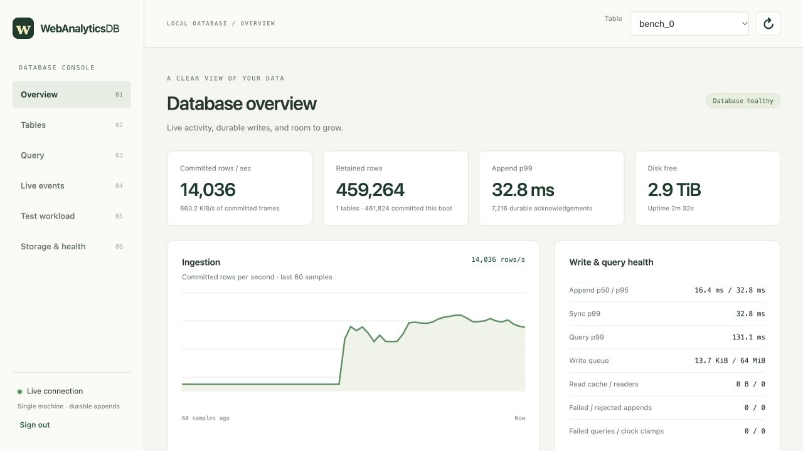
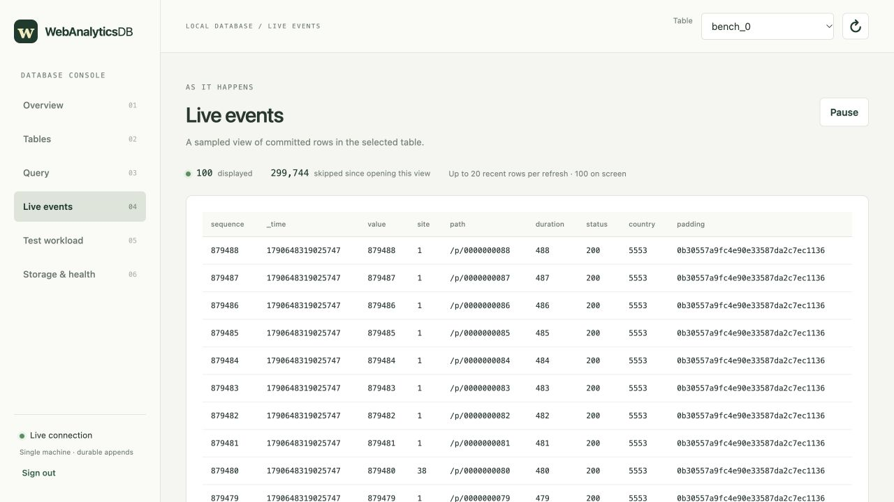

# Capacity with the console rendering

The [raw report](macos-browser.json) records a 60-second workload on an Apple
M1 Max (10 cores, 64 GiB RAM), Darwin 27 / Apple Clang 21, internal APFS SSD.
The production `-O2 -g` server used `F_FULLFSYNC` durable acknowledgements.
The machine is a MacBookPro18,2 with an internal 8 TB SSD, about 3.2 TB free,
APFS on the Data volume, and FileVault enabled.
Four independent HTTP producer threads sent 64-row requests into one table of
48-byte rows with 100 path symbols and skewed site IDs. The driver also ran a
fast SSE reader and statistics/table/tail polling plus broad count/sum queries.

An actual Codex in-app browser connected before ingestion began. The overview
was open for roughly the first 40 seconds; the Live events screen was open for
the remainder. Both rendered changing database state. This is a single run on
a development workstation, not a general maximum-capacity claim.

| Measurement | Result |
| --- | ---: |
| Elapsed ingestion including drain | 60.009 seconds |
| Durable acknowledged rows | 901,952 |
| Committed throughput | 15,030 rows/second |
| Append rejection / failure / generator drops | 0 / 0 / 0 |
| Arrival-to-ack p50 / p95 / p99 | 15.9 / 25.6 / 33.8 ms |
| Maximum observed append latency | 518.2 ms |
| Server CPU during ingestion | 10.27 CPU seconds |
| Independent client CPU | 6.30 CPU seconds |
| Server lifetime peak RSS | 11.8 MiB |
| Retained source bytes / logical row bytes | 43,660,264 / 43,293,696 |
| Independent concurrent aggregate queries | 53; all succeeded |
| Concurrent aggregate p99 | 233.5 ms |
| Server restart | 207.7 ms |
| Post-restart broad count/sum query | 195.5 ms first, 195.3 ms repeated |

After clean shutdown, the driver restarted the server and matched both exact
row count and input-ID sum to successful receipts. The independent monitor
received 238 commit and 59 statistics events. Its initial subscription received
one expected reset because it subscribed without a boot/feed cursor; it then
stayed connected during ingestion. All 53 poll
cycles completed without monitoring rejection.

The overview capture showed live throughput, 461,824 commits and zero failed or
rejected appends. The later live view displayed exactly 100 sampled rows and an
explicit 299,744 skipped-row count; its latest sequence had advanced to 879,488.
No browser error or warning was captured during these observations. Skipped
samples are console sampling, not loss from storage. The temporary tab and
database were closed/removed after the run.

Browser CPU was not measured separately; it ran on the same host as the client
and server. Mac HTTP kernel I/O accounting is unavailable in this driver, so
those fields remain null. Current RSS grew from about 8.6 to 11.8 MiB while the
active frame index grew; the source dataset reached 41.6 MiB. The separate
Linux [larger-than-memory workload](linux-memory-2026-09-28.md) covers eviction
and a dataset exceeding the process/container memory budget.
